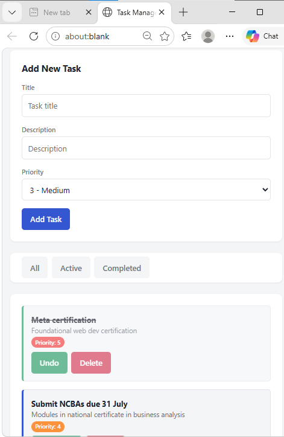
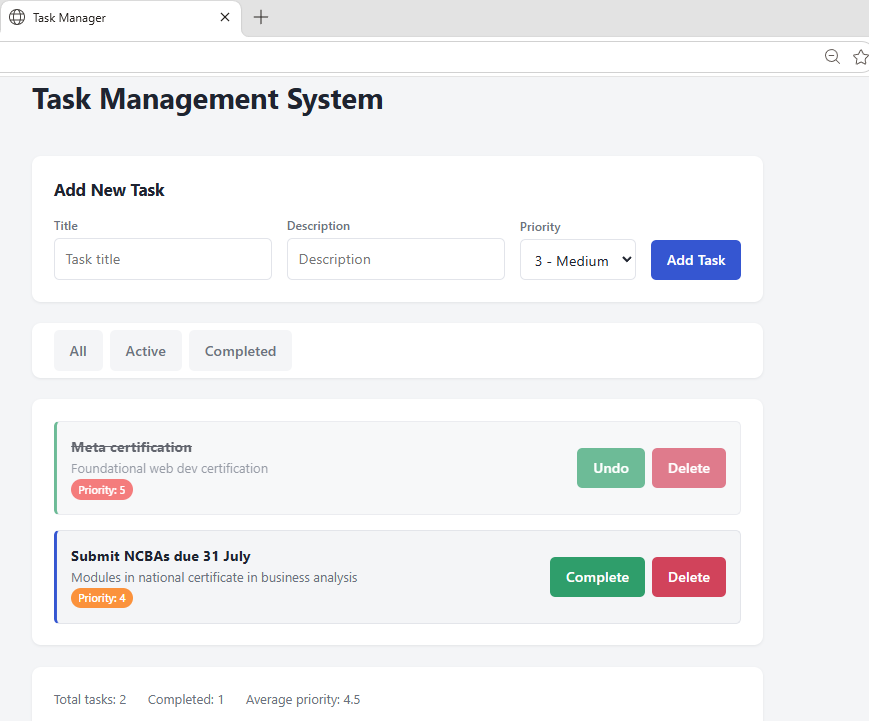
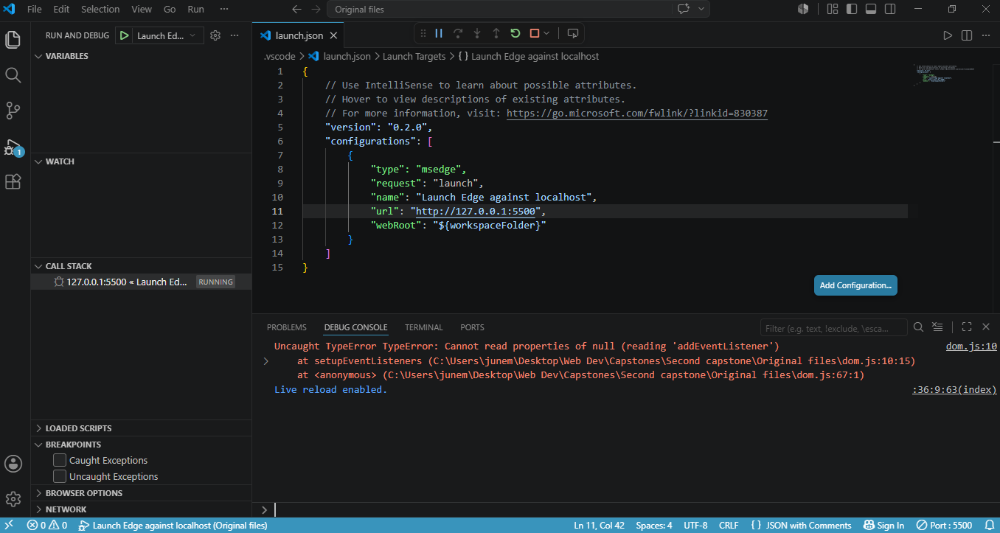
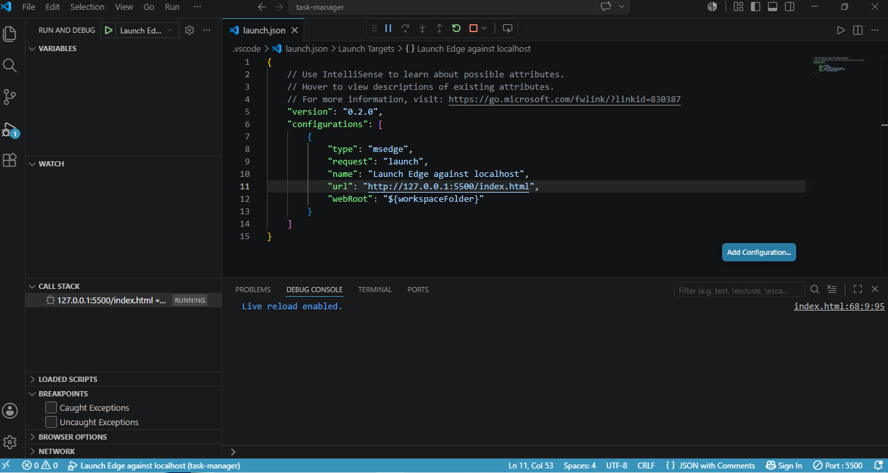
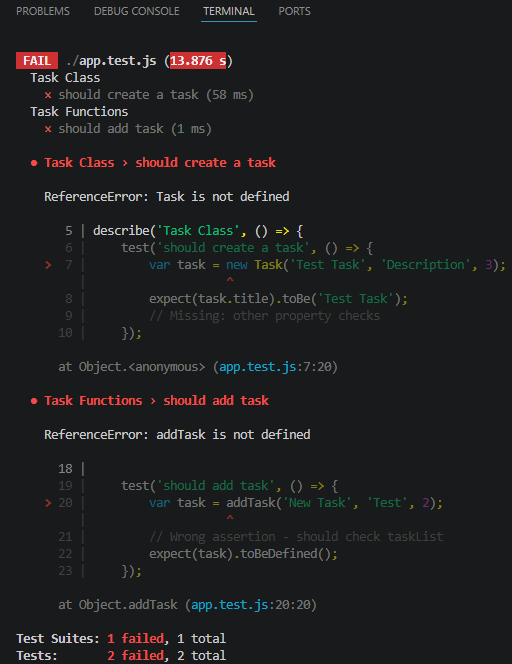
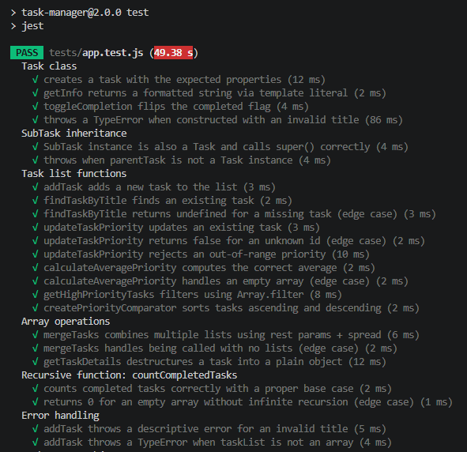
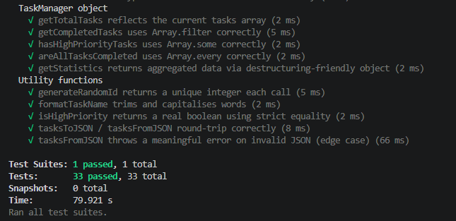

# Task Management Application


## Overview

This is a task management application that was 60% complete. At first, it contained errors and incomplete code. Now errors have been debugged and fixed. The code is also completed where it was initially incomplete. A summary of the errors and fixes are given below. Detailed errors and fixes can be found on the `issues-identified` document.

## Project structure

```
task-manager/
├── screenshots/  app-running.png, console-no-errors.png, tests-passing(1).png, etc
├── src/          app.js, dom.js, utils.js, storage.js
├── tests/        app.test.js
├── .gitignore
├── babel.config.cjs
├── index.html
├── issues-identified.docx
├── package-lock.json
├── package.json
└── styles.css
│  
README.md

```

## Errors found

- **app.js — Variables/OOP/Functions:** implicit global `taskList`,
  `var` usage; `Task` missing `id`/`toggleCompletion`; `SubTask` missing
  `super()`; off-by-one loop; `findTaskByTitle` missing its `title`
  param; `==`/`=` used instead of `===`; no destructuring/spread/rest;
  `countCompletedTasks` recursion had no base case; average-priority
  divide-by-zero; manual loops instead of `filter`; `TaskManager` had
  only one method; no module exports.

- **dom.js — DOM/Events:** mismatched ID/class selectors, missing `#`;
  no null checks; only one listener (no submit/delete/filter handling);
  no `preventDefault`/validation/input clearing; list re-render never
  cleared old content; click handler read `event.target.id` instead of
  delegating; init ran before `DOMContentLoaded`; no JSON/localStorage.

- **utils.js — Data/Storage:** `saveToStorage`/`loadFromStorage` skipped
  `JSON.stringify`/`parse`; `generateRandomId` returned a raw decimal;
  `formatTaskName` was a no-op; `isHighPriority` used `==` and returned
  strings instead of a boolean.

- **index.html:** no priority input, no statistics container, two
  unordered classic `<script>` tags instead of one module.

- **styles.css:** `#app` selector never matched the actual `.container`
  markup; fixed-width only, no responsive breakpoints or design tokens.

- **app.test.js:** no imports, no `beforeEach`, almost no real
  assertions or coverage.

## Fixes implemented

- **app.js:** `const`/`let` everywhere; added `id`/`createdAt`/
  `toggleCompletion()`; `super()` call and method override in `SubTask`;
  `for...of` loops; fixed params/operators; object destructuring in
  `getTaskDetails`; `mergeTasks(...lists)` with rest + spread; recursion
  given a proper base case; empty-array/typeof/range validation with
  descriptive errors and `try/catch`; `TaskManager` gained
  map/filter/reduce/find/some/every-based methods and a higher-order
  `createPriorityComparator`; converted to an ES6 module.

- **dom.js:** correct selectors with null checks; 5+ listeners (add
  button, form submit, delegated list click, filter buttons, storage
  sync); validation + `preventDefault` + form reset; container cleared
  before re-render with template literals; `closest('[data-action]')`
  event delegation; init moved to `DOMContentLoaded`; wired to
  `storage.js` for persistence.

- **utils.js:** real `JSON.stringify`/`parse` in try/catch; unique
  integer ids; working `formatTaskName`; boolean `isHighPriority` via
  `===`; added `tasksToJSON`/`tasksFromJSON`.

- **storage.js (new):** rehydrates stored plain objects back into `Task`
  instances; exposes `persistTasks`/`restoreTasks`.

- **index.html:** added priority select, error/stats markup, single
  `<script type="module" src="src/dom.js">`.

- **styles.css:** CSS custom-property tokens, mobile-first layout with
  breakpoints at 640px/960px, `:focus-visible`, `prefers-reduced-motion`,
  and styling for priority/completed/empty/error states.

- **tests/app.test.js:** real imports, `beforeEach` reset, 33 tests
  covering classes, inheritance, array ops, recursion, destructuring/
  spread, error handling and edge cases.

## Additional files

1. `package-lock.json` is for reproducible installs,

2. `babel.config.cjs` lets Jest understand the same modern import/export syntax the browser already understands natively.

`Neither one is required to actually run the app` — only to install dependencies consistently and run the test suite.

3. `.gitignore`: Tells Git which files/folders to never track or commit, even if they exist in the project folder. For example the node_modules folder, which is a large folder, is ignored upon committing the project. Any user that wants to clone and run the project can install their own node_modules.

4. `storage.js`: it's the bridge between the Task class model and the browser's localStorage.

`persistTasks(taskList)` — takes the live array of Task objects and saves it to localStorage.

`dom.js calls restoreTasks()` on startup to load saved tasks as real objects, and calls persistTasks() every time a task is added, toggled, or deleted, to keep localStorage in sync.


## How to run the app

### Using VS code:
1. Copy the URL: Go to your repository hosting service (like GitHub), click the green Code button, and copy the HTTPS or SSH link.
2. Open Command Palette: Launch VS Code and press Ctrl + Shift + P (or Cmd + Shift + P on a Mac).
3. Run Clone Command: Type Git: Clone into the prompt and press Enter.
4. Paste the Link: Paste the copied repository URL and press Enter.
5. Select a Folder: Pick the local folder on your computer where you want to store the project files.
6. Open the Project: A notification pop-up will appear in the bottom right corner asking if you want to open the repository. Click Open.
7. Select the `index.html` file. You can preview the app locally or open with external browser.

## Running the tests

```bash
npm install
npm test
```

Result: `Test Suites: 1 passed, 1 total` · `Tests: 33 passed, 33 total`.
See `screenshots folder` or `screenshots section` below the for images of the app running, the console (with no errors), and the
passing Jest output.

## Reflection

The hardest bug was `taskList[i].id = taskId` in `updateTaskPriority`:
`=` is valid JS, so it never threw — it silently overwrote every task's
id and always returned `true`. It only surfaced once a test asserted
other tasks' ids stayed unchanged. `countCompletedTasks` was similar: it
looked fine until exercised with a real finite array, where it blew the
call stack — exactly what a base-case/edge-case test is for.

## Screenshots

### App before debugging and implementing fixes:

<div align="center">  </div>


### App for mobile devices after fixes:

<div align="center">  </div>


### App running after fixes:

<div align="center">  </div>


### Console showing an error before debugging and fixing:

<div align="center">  </div>


### Console showing no errors after implementing fixes:

<div align="center">  </div>


### Tests failing before fixing:

<div align="center">  </div>


### Tests passing after fixing:

<div align="center">  </div>


### More tests passing after fixing:

<div align="center">  </div>